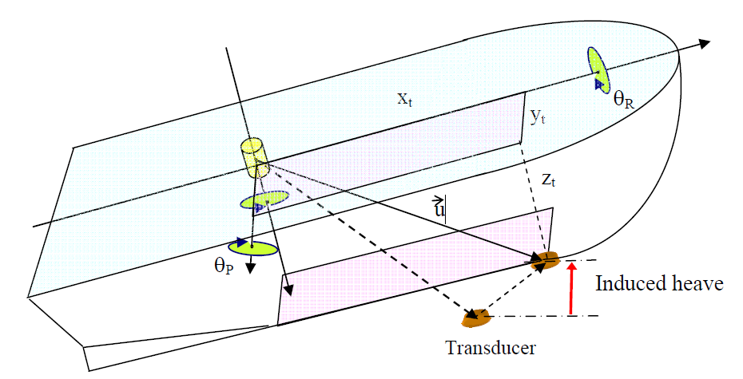

---
title: Manual on Hydrography
...

Sources of errors and quality control techniques
================================================

Due to roll, pitch and heave
----------------------------

To calculate the induced heave, consider the vessel to be a rigid body which is free to rotate around the three axes (x, y & z) as mentioned in 3. The rotation about the centre of gravity (roll and pitch), near which heave is usually measured, corresponds to a transducer depth variation, from the vessel reference frame (identified with the script **V**) to a local co-ordinate system (identified with the script **L**). This difference is called induced heave.

The induced heave, adapted from [@hare_accuracy_1995] for the reference frames defined in 3 and Annex A, is given by:

$$h_{i} = z_{t}^{L} - z_{t}^{V} = -x_{t}^{V} \sin(\theta_{P}) + y_{t}^{V} \cos(\theta_{P}) \sin(\theta_{R}) + z_{t}^{V} (\cos(\theta_{P}) \cos(\theta_{R}) - 1)$$

where $\theta_{R}$ is the roll angle, $\theta_{P}$ is the pitch angle and ($x_{t}$, $y_{t}$ & $z_{t}$) are the transducer co-ordinates.

The total error on the depth measurement due to heave is therefore,

$$dh = dh_{m} + dh_{i}$$

where $dh_{m}$ is the error in heave measurement and $dh_{i}$ is the error in the induced heave determination.

